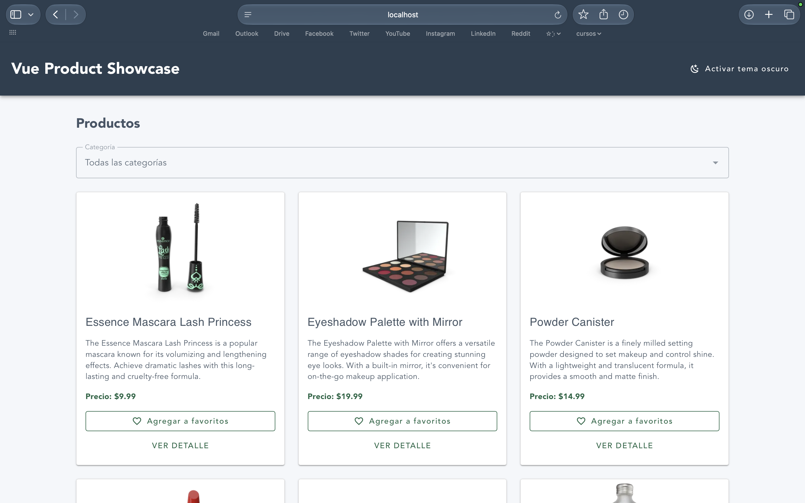
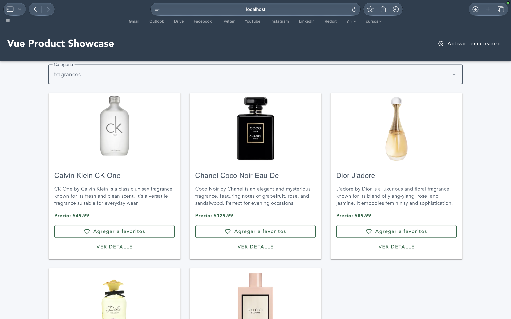
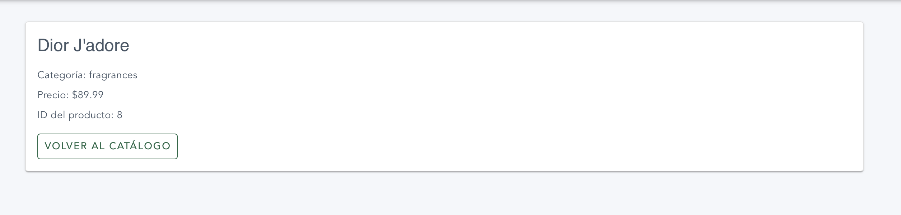
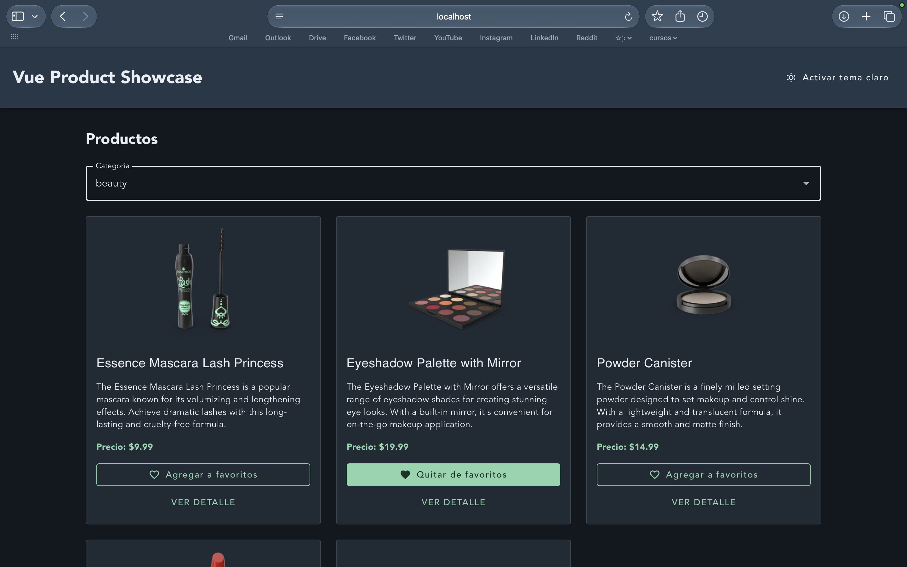
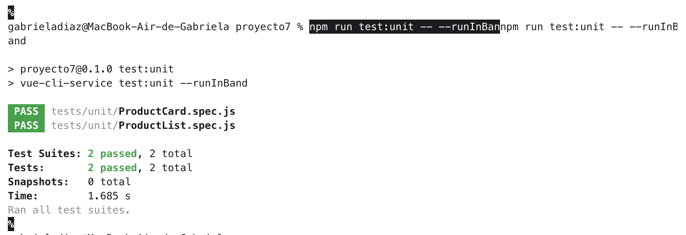
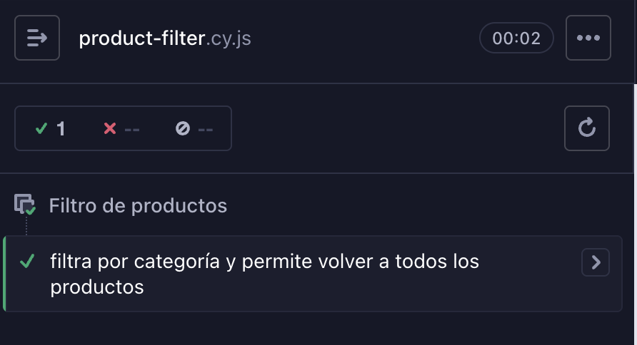

# Proyecto Módulo 7 – Vue Product Showcase

## 📖 Descripción

Este proyecto corresponde a la evaluación del Módulo 7 del curso **Desarrollo de Aplicaciones Front-End Trainee**.

La aplicación es una SPA (Single Page Application) desarrollada con Vue.js que permite visualizar un catálogo dinámico de productos obtenidos desde una API REST. Los usuarios pueden filtrar productos por categoría, marcarlos como favoritos y acceder a una vista individual con información detallada de cada producto.

El proyecto utiliza una arquitectura basada en componentes reutilizables, gestión centralizada del estado mediante Vuex, navegación con Vue Router y una interfaz responsive desarrollada con Vuetify.

## ⚙️ Funcionalidades

- **Catálogo dinámico:** consumo de productos desde la API pública DummyJSON mediante Axios.
- **Estados de carga:** manejo visual de los estados de carga, error y ausencia de productos.
- **Filtro por categorías:** permite visualizar productos pertenecientes a una categoría específica.
- **Gestión global del estado:** implementación de Vuex mediante módulos independientes para productos, filtros y favoritos.
- **Favoritos:** permite agregar y quitar productos de favoritos manteniendo su estado durante la navegación.
- **Detalle de productos:** navegación hacia una vista individual mediante rutas dinámicas.
- **Navegación SPA:** implementación de Vue Router y navegación programática mediante `router.push()`, utilizando parámetros de ruta y query params.
- **Composition API:** componentes desarrollados mediante `<script setup>`, incluyendo el uso de `computed`, `defineProps`, `useStore`, `useRouter`, `useRoute` y `onMounted`.
- **Ciclo de vida:** uso de `onMounted()` para iniciar la carga de productos.
- **Diseño responsive:** distribución adaptable de productos en una, dos o tres columnas según el tamaño de pantalla.
- **Tema claro y oscuro:** cambio dinámico de tema mediante Vuetify.
- **Accesibilidad:** uso de etiquetas, roles y estados visuales para facilitar la interacción mediante teclado y tecnologías de asistencia.
- **Pruebas automatizadas:** pruebas unitarias con Jest y Vue Test Utils, además de una prueba end-to-end con Cypress.

## 🧰 Tecnologías utilizadas

- Vue 3
- Vue CLI 5
- Vue Router 4
- Vuex 4
- Vuetify 3
- Axios
- JavaScript
- HTML5
- CSS3
- Jest
- Vue Test Utils
- Cypress
- DummyJSON API

## 📂 Estructura del proyecto

```text
src/
├── components/
│   ├── AppHeader.vue
│   ├── AppFooter.vue
│   ├── ProductCard.vue
│   └── ProductList.vue
├── plugins/
│   └── vuetify.js
├── router/
│   └── index.js
├── store/
│   ├── modules/
│   │   ├── products.js
│   │   ├── filters.js
│   │   └── favorites.js
│   └── index.js
├── views/
│   └── DetalleProducto.vue
├── App.vue
└── main.js

tests/
└── unit/
    ├── ProductCard.spec.js
    ├── ProductList.spec.js
    └── setup.js

cypress/
├── e2e/
│   └── product-filter.cy.js
└── fixtures/
    └── products.json
```

## ⚙️ Instalación

Clonar el repositorio:

```bash
git clone https://github.com/gdiazcontreras/evaluacion-m7.git
```

Ingresar al proyecto:

```bash
cd evaluacion-m7
```

Instalar dependencias:

```bash
npm install
```

Iniciar el servidor de desarrollo:

```bash
npm run serve
```

Ejecutar las pruebas unitarias:

```bash
npm run test:unit
```

Ejecutar las pruebas E2E:

```bash
npm run test:e2e
```

## 🌐 Repositorio

El proyecto está publicado en GitHub:

👉 [Ver repositorio](https://github.com/gdiazcontreras/evaluacion-m7)

## 🚀 Deployment

El proyecto está desplegado en GitHub Pages:

👉 **Ver aplicación**

## 📸 Capturas

### Catálogo de productos

Vista principal del catálogo con productos obtenidos desde la API.



### Filtro por categoría

Ejemplo de productos filtrados mediante el selector de categorías.



### Detalle de producto

Vista individual de un producto mediante una ruta dinámica.



### Tema oscuro

Interfaz del catálogo utilizando el tema oscuro.



### Pruebas unitarias

Ejecución exitosa de las pruebas unitarias realizadas con Jest y Vue Test Utils.



### Prueba end-to-end

Ejecución exitosa del flujo de filtrado automatizado mediante Cypress.



## 👩‍💻 Autora

Proyecto realizado por **Gabriela Díaz Contreras**.

## 🤖 Apoyo con IA

Durante el desarrollo de este proyecto utilicé herramientas de Inteligencia Artificial (**ChatGPT y Codex**) como apoyo para:

- Revisar errores y posibles problemas en el código.
- Apoyar la planificación y organización de la arquitectura del proyecto.
- Revisar la implementación de componentes, estado global y navegación.
- Apoyar la configuración y revisión de las pruebas automatizadas.
- Contrastar el proyecto con los requisitos entregados en la consigna.
- Crear y dar forma al archivo README.md.

El trabajo final, las decisiones de implementación y la validación del funcionamiento de la aplicación fueron realizadas por mí, utilizando la IA como guía y apoyo durante el proceso.